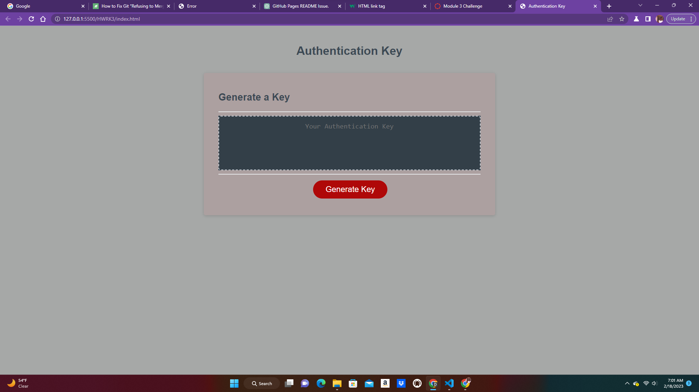

# Aunthentication KEY
### Description
Users can generate a key by typing a number to determine the length of the key, any other character input by the user won't be accepted and the user will be alerted to enter a number.
### Screenshots

#### Links
- https://clyf101.github.io/HWRK3/
- https://github.com/Clyf101/HWRK3
